<div align="center">



<br/>

<a href="https://github.com/0l1ve1ra">
  
</a>

<br/>

<a href="https://www.linkedin.com/in/0l1ve1ra/"></a>
<a href="https://github.com/0l1ve1ra"></a>

</div>

---

## About me / Sobre mim

```text
PLAYER ..... João Vítor
CLASS ...... Infrastructure Analyst (Cloud)
BASE ....... Rio de Janeiro, BR
BADGES ..... AZ-900
NEXT ....... AZ-104 > AZ-305
LANGUAGES .. PT / EN (advanced) / ES (intermediate)
```

**EN** — I work on the Cloud Infrastructure team at Multipagamentos. My day to day is going through Azure alerts, checking them against real data in Log Analytics and figuring out what's signal and what's noise. Before that I spent three years in support, from N1 to N2, which taught me how things break in production. I'm a History graduate (FEUC) now studying Computer Science (UVA), and I'm working my way toward Cloud Engineering, with a strong interest in the banking sector.

**PT** — Trabalho no time de Infraestrutura Cloud da Multipagamentos. No dia a dia, analiso alertas do Azure, comparo com os dados reais do Log Analytics e separo o que é sinal do que é ruído. Antes disso, foram três anos em suporte, do N1 ao N2, onde aprendi como as coisas quebram em produção. Sou formado em História (FEUC), hoje curso Ciência da Computação (UVA) e estou construindo meu caminho para Cloud Engineering, com muito interesse no setor bancário.

<details>
<summary><b>Courses & bootcamps / Cursos e bootcamps</b></summary>
<br/>

- FIAP: Cloud Fundamentals, Administration and Solution Architect (80h)
- FIAP: IA Agêntica / Agentic AI (40h)
- FIAP: Gestão de Infraestrutura de TI (20h)
- MBX / USP: Gestão de TI (80h)
- Bootcamp Bradesco: GenAI, Dados & Cyber *(in progress / em andamento)*
- Santander: AI Data Marketing Creator *(in progress / em andamento)*
- Universia: Primeiros Passos em Power BI *(in progress / em andamento)*

</details>

---

## Tech stack / Tecnologias

<div align="center">


<br/><br/>


</div>

---

## Projects / Projetos

<table>
<tr>
<td width="50%" valign="top">

### 🗺️ Cloud Architect Roadmap
**EN** Interactive study path for anyone starting Cloud from zero: 19 stages, 343 topics, 19 portfolio projects and 8 mapped certifications, Azure-first with a financial-sector track.
<br/>**PT** Trilha de estudos interativa para quem quer começar em Cloud do zero, com foco em Azure e uma trilha para o setor financeiro.

 

`▶ public` · <a href="https://github.com/0l1ve1ra"><!-- TODO: link do repo ou do Netlify -->View / Ver</a>

</td>
<td width="50%" valign="top">

### 🧱 Azure 3-Tier Network with Terraform
**EN** VNet with web, app and data subnets. The data subnet only accepts port 1433 from the app subnet, App Service runs with VNet integration and Azure SQL is locked to the network.
<br/>**PT** Rede em três camadas com privilégio mínimo, provisionada 100% como código.

 

`▶ public` · <a href="https://github.com/0l1ve1ra"><!-- TODO: link do repo -->View / Ver</a>

</td>
</tr>
<tr>
<td width="50%" valign="top">

### 🤖 RAG Agent + Chatbot
**EN** AI agent that answers from a document knowledge base using retrieval (RAG), plus a chatbot built on LLM integration and prompt design. Built in the Bradesco GenAI bootcamp.
<br/>**PT** Agente de IA com busca em base de conhecimento documental e chatbot com integração a LLM.

 

`▶ public` · <a href="https://github.com/0l1ve1ra"><!-- TODO: link do repo -->View / Ver</a>

</td>
<td width="50%" valign="top">

### 🚨 Azure Alert Audit
**EN** Cross-checks alerts received by the team against real Log Analytics data, sorts them into true and false positives and turns that into cleanup recommendations.
<br/>**PT** Auditoria de alertas do Azure: verdadeiros x falsos positivos, com recomendações de limpeza.

 

`■ internal / interno`

</td>
</tr>
<tr>
<td width="50%" valign="top">

### 📋 NOC Rounds Panel
**EN** Checklist web app the NOC team uses for monitoring rounds at fixed times, with items that change by day.
<br/>**PT** Painel de Rondas: checklist em HTML usado pela equipe NOC nas rondas de monitoramento.

 

`■ internal / interno`

</td>
<td width="50%" valign="top">

### 📊 DevOps Ticket Reporting
**EN** Power Automate flows feeding Power BI reports on support tickets from Azure DevOps.
<br/>**PT** Relatórios de chamados do Azure DevOps com Power Automate e Power BI.

 

`■ internal / interno`

</td>
</tr>
<!-- NOVO PROJETO: copie um bloco <td>...</td> acima e cole aqui dentro de um novo <tr> -->
</table>

### Quest log / Próximas missões

Portfolio roadmap toward Cloud Engineer, focused on banking. / Roadmap de portfólio rumo a Cloud Engineer, com foco no setor bancário.

- [x] **IaC fundamentals** — Azure 3-tier network with Terraform / Rede em 3 camadas com Terraform
- [ ] **DevOps automation** — CI/CD pipelines for infrastructure / Pipelines de CI/CD para infraestrutura
- [ ] **Fraud detection** on Azure / Detecção de fraude no Azure
- [ ] **Identity & access (IAM)** for a banking scenario / IAM para um cenário bancário
- [ ] **LGPD compliance** controls / Controles de conformidade com a LGPD
- [ ] **Disaster recovery** strategy / Estratégia de recuperação de desastres
- [ ] **Banking landing zone** (roadmap capstone) / Landing zone bancária

---

## GitHub stats / Estatísticas

<div align="center">


</div>

### Trophies / Troféus

<div align="center">


</div>

### Snake

<div align="center">

<picture>
  <source media="(prefers-color-scheme: dark)" srcset="https://raw.githubusercontent.com/0l1ve1ra/0l1ve1ra/output/github-snake-dark.svg"/>
  <source media="(prefers-color-scheme: light)" srcset="https://raw.githubusercontent.com/0l1ve1ra/0l1ve1ra/output/github-snake.svg"/>
  
</picture>

</div>

---

<div align="center">

<a href="https://www.linkedin.com/in/0l1ve1ra/"></a>

<br/><br/>



</div>
